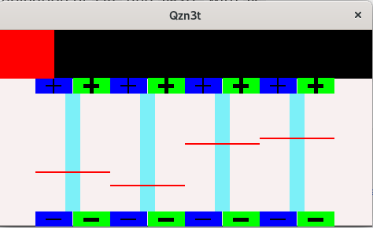
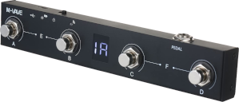

# 120Pedal - MIDI Guitar Pedal Controller 🎸


**THIS BARELY WORKS**

A system to control simulated guitar pedals using a MIDI foot controller. Designed primarily for Raspberry Pi 4/5, it allows real-time switching of audio effects via Jack audio connections.



## Key Features
- Real-time audio routing (<100ms latency)
- Supports any  effects simulator with Jack audio I/O
  - Currently only mono effects are fully supported
- LV2 plugin integration via `mod-host` and `mod-ui`
- MIDI controller configuration
- GUI for setting audio levels of each effect
  - Includes  a mute switch

## System Requirements
- [Raspberry Pi](https://www.raspberrypi.com/) 4 or 5 (recommended)
  - This version is specifically adapted to Raspbery Pi **7-inch touch screen**
    - There is a bug in the X11 interface where touch points are rotated from where the user touches.  This version compensates for that.
- Debian 12 ([Patchbox OS](https://blokas.io/patchbox-os/))
  - Patchbox OS comes with the unessential but useful [Modep](https://blokas.io/modep/) software preinstalled.
- Compatible audio interface
- MIDI foot controller


## Installation

### Recommended OS: Patchbox OS
* Download [Patchbox OS](https://blokas.io/patchbox-os/)
* Ensure the sound card is connected before installing the OS
* Place the file `/ssh` on the root partition
* Patchbox OS default user/password is patch/blokaslabs
* Install with these settings:
   - Select no additional modules during installation
   - Configure your audio interface settings
* Post-installation:
```bash
sudo apt update
sudo apt upgrade
sudo apt install modep-mod-ui git curl build-essential
sudo systemctl disable modep-mod-ui  # Prevent mod-ui from auto-starting
```

For getting the Hot Point to work (that you can set up using `patchbox-config`) it may be necessary to do:
```sh
sudo systemctl disable dnsmasq
sudo systemctl stop dnsmasq
```

Optional: Remove Telemetry
---

Patchbox OS includes opt-out telemetry. To remove:
```bash
sudo apt purge blokas-telemetry
```


### Other distributions

To run LV2 simulators an LV2 host is required.  The host [`mod-host`](https://github.com/worikgh/mod-host) is recommended.

It is a sub module of `120Pedal`

It is possible to use Modep, and in particular, `mod-ui`, an Debian-12, (Debian-13 is unknown) but it is not trivial.  Use [this](https://github.com/worikgh/mod-ui/tree/raspberrypi-bookworm) and follow the instructions in the `README.md`.

`mod-ui` will not play nicely with [Patchstorage](https://patchstorage.com/)  and it will not display the nice PNG images of pedals like it will if you install from Patchbox OS, but it is still very useful

### Software Setup

1. Install required packages:

```bash
sudo apt install dnsmasq git hostapd iw jackd2 libasound2-dev \
libjack-jackd2-dev liblilv-dev libreadline-dev libsdl2-dev \
libsdl2-image-dev lv2-dev pkg-config python3.11-dev libipc-run-perl \
libtry-tiny-perl -y
```

2. Install Rust:

```bash
curl --proto '=https' --tlsv1.2 -sSf https://sh.rustup.rs | sh
source ~/.profile
```

## Configuration

### Creating a Desktop shortcut

Create the file: `.local/share/applications/120Pedal.desktop`

Contents
```
[Desktop Entry]
Name=120Pedal GUI
Exec=$HOME/120Pedal/gui/run.sh
Icon=$HOME/120Pedal/gui/120Pedal.svg
Terminal=false
Type=Application
```

Make executable: `chmod a+x ~/.local/share/applications/120Pedal.desktop`

Put on Desktop

```
cp ~/.local/share/applications/120Pedal.desktop ~/Desktop/
chmod +x ~/Desktop/120Pedal.desktop
```

### Auto-login for `patch`

Ensure `patch` is in group `lightdm`: `sudo usermod -aG lightdm patch`

In the `[Seat:*]` part of the file `/etc/lightdm/lightdm.conf` specify `autologin-session` and `autologin-user`

* `autologin-session` is the sessin to run for autologin.  The file must exist in `/usr/share/xsessions/`
  - E.g: `autologin-session=LXDE` implies the file `/usr/share/xsessions/LXDE.desktop` exists
  - You may need to create it.  It can be a link to an existing file
* `auologin-user` is the user that will be logged in automatically

```
[Seat:*]
autologin-session=LXDE
autologin-user=patch
```

`sudo systemctl restart lightdm`

### Auto-starting the GUI
```bash
mkdir -p ~/.config/autostart
cat > ~/.config/autostart/120pedal.desktop <<EOF
[Desktop Entry]
Type=Application
Name=120Pedal
Exec=/bin/bash -c "sleep 5 && \${HOME}/120Pedal/gui/run.sh"
Comment=120Pedal Controller
X-GNOME-Autostart-enabled=true
X-GNOME-Autostart-Delay=10
EOF
chmod +x ~/.config/autostart/120pedal.desktop
```

### Jack Audio Setup

If not using Patchbox OS (that takes care of this):

1. Identify your audio interface:
```bash
aplay -l | grep "Your Interface Name"
```

2. Create `/etc/systemd/system/jackd.service`:
```ini
[Unit]
Description=JACK Audio Connection Kit
After=sound.target

[Service]
ExecStart=/bin/sh -c 'CARD=$(aplay -l | grep -m1 "Your Interface" | cut -d" " -f2 | tr -d ":"); exec /usr/bin/jackd -d alsa -d hw:$CARD -r 48000 -p 128 -n 2'
Restart=always
User=your_username
Group=audio
LimitMEMLOCK=8589934592
LimitRTPRIO=89
Environment="XDG_RUNTIME_DIR=/run/user/$(id -u your_username)"
Environment="JACK_NO_AUDIO_RESERVATION=1"

[Install]
WantedBy=multi-user.target
```

3. Enable Jack:
```bash
sudo systemctl start jackd
sudo systemctl enable jackd
```

### mod-host Setup

Patchbox OS provides a version of `mod-host` but this uses a forked version

```bash
cd
git clone https://github.com/worikgh/mod-host.git
cd mod-host
make
./mod-host -n -p 5555
```

### mod-ui Installation

If not using Patchbox OS

```bash
cd
git clone https://github.com/worikgh/mod-ui.git
cd mod-ui
python3 -m venv myenv
source myenv/bin/activate
pip3 install -r requirements.txt

# Apply necessary patches
find myenv/lib/python* -name httputil.py | xargs sed -i 's/collections.MutableMapping/collections.abc.MutableMapping/'
make -C utils
export MOD_DEV_ENVIRONMENT=0
python3 ./server.py
```

Access the interface at `http://<your-pi-ip>:8888`  (**Not HTTPS**)

If using Patchbox OS access the interface at `http://<your-pi-ip>` (**Not HTTPS**)

## Setting Up Pedals

1. Clone the repository:
```bash
cd
git clone https://github.com/worikgh/120Pedal.git --recurse-submodules
cd 120Pedal/gui
cargo build --release
cd ../midi_driver
cargo build --release
```

2. Configure your pedal setups in the `PEDALS/` directory (see [PEDALS/README.md](PEDALS/README.md))

3. For LV2 simulators:
```bash
./getLV2  # Reads mod-ui pedal configurations
./cfgEffects  # Sets up LV2 simulators and Jack connections
```

**TODO: Make some pedals**

**TODO: Making pedals documentation**

## MIDI Pedal Configuration

The MIDI pedal is driven with three components:

1. A reader: `read_midi` that connects to the device and outputs the MIDI data on its STDOUT
2. A translator: `translate_midi` that reads MIDI on its STDIN and writes (translated) MIDI on its STDOUT
3. An actor: `jack_midi` that reads MIDI on its STDIN and sets up Jack audio pipes

### Example: SINCO MIDI Pedal


1. **Read MIDI Input**:
```bash
read_midi SINCO
```

2. **Translate MIDI Commands**:
```bash
translate_midi examples/sinco.cfg
```

3. **Control Jack Connections**:
```bash
jack_midi examples/midi_jack.cfg
```

### Pipeline Example
```bash
(export PATH=$PATH:$(pwd)/midi_driver/target/release
read_midi SINCO | translate_midi examples/sinco.cfg | jack_midi examples/sas_house.cfg)
```

## Pedal Configuration Files
Example pedal definition (`PEDALS/lost_world`):
```
system:capture_1 effect_14:in
effect_13:Out1 system:playback_1
```

## Troubleshooting
- Ensure Jack is running before starting mod-host
- Verify your audio interface is properly detected
- Check MIDI device permissions
- Using SSH log into the Pi and `tail /tmp/gui.log` (**TODO: Integrate with systemd logging**)

## Non-LV2 Effects

### Mono Effects

In the directory `mono/`
See the [README](mono/README.md) in that file for description of how they work


### Pure Data

* Sub module: `basic-pure-data-audio-effects`

## Backing up

**Incomplete section**

To back up the state of 120Pedal

* Modep: `tar cfz /tmp/modep.tgz /var/modep/`
* 120Pedal: `tar cfz /tmp/pedals.tgz /home/patch/120Pedal/PEDALS/`

Copy the files `/tmp/modep.tgz` and `/tmp/pedals.tgz` to a safe place
